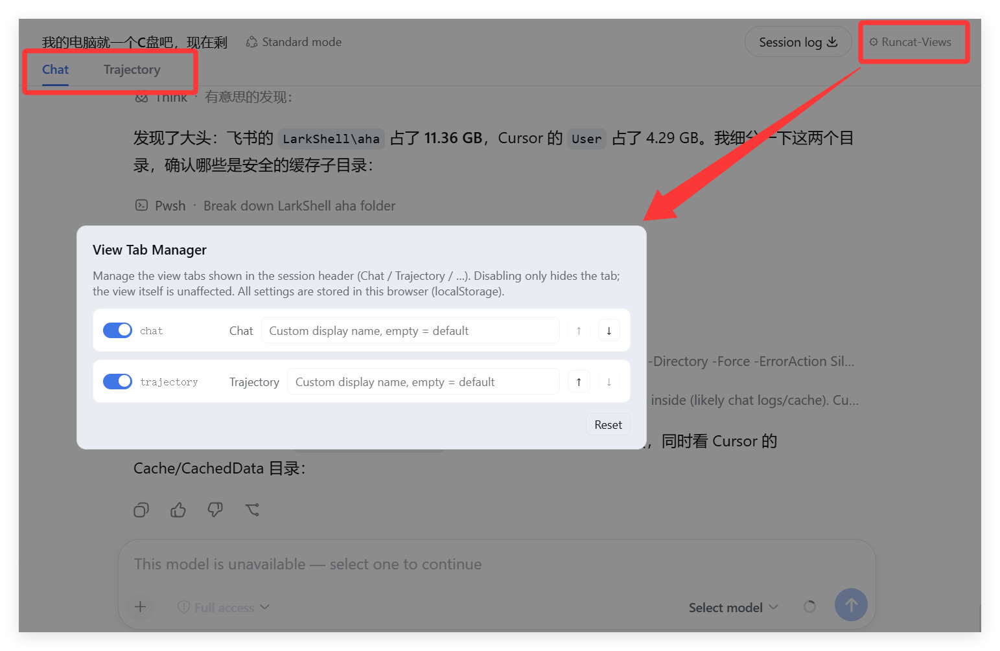

# dsh-view-manager

Manage the **view tabs** in the DeepSeek Harness Web GUI session header — the
tabs contributed through the `conversation.view` slot (e.g. **Chat / 对话**,
**Trajectory / 轨迹**, and any future view plugins).

| English | [简体中文](README.md) |
| --- | --- |

## Features

- **Enable / disable**: disabling a view tab hides its label in the session
  header (the view itself keeps working)
- **Reorder**: move tabs up/down to change their display order
- **Rename**: set a custom display label (empty restores the default)
- **Locale-aware**: plugin copy follows the DSH UI language (zh / en)
- **Local storage**: configuration lives in browser localStorage and applies
  immediately — no restart needed
- **Update reminders**: automatically detects newer versions on npm; a red
  badge on the button plus an update card in the panel — with
  "Update now / Ignore this version / Later"

## Preview



## Install

**Option 1: install from npm (recommended)**:

```sh
dsh plugin --profile web add dsh-view-manager
```

**Option 2: install from GitHub**:

```sh
dsh plugin --profile web add github:runcat-tommy/dsh-view-manager
```

**Option 3: local development** — clone this repo, then run from inside the
project folder:

```sh
cd dsh-view-manager
dsh plugin --profile web add .
```

**Restart the Web UI** after installing, then open any session — a
**⚙ Runcat-Views** button appears at the far right of the session header.

## Usage

1. Open a session (Chat or Trajectory)
2. Click **⚙ Runcat-Views** at the far right of the session header
3. Each view gets one row:
   - Toggle: enable / disable (disabled = tab hidden)
   - `Original`: the default label (follows the UI language)
   - Input: custom display name (empty restores default)
   - ↑ / ↓: reorder
   - **Reset**: clear all custom configuration

### Update reminders

- When a new version is found, a red badge appears on the button; hover to
  see the version number
- An update card shows at the top of the panel:
  - **Update now** → confirm the command → run the update → verify the
    version → prompt to restart the Web UI
  - **Ignore this version** → stop reminding for that version (restore via
    "Restore reminder" in the card)
  - **Later** → collapse the card
- In local development mode (link/file source) the update button is disabled
  automatically

## How it works

- Data source matches the host: `slots.entries("conversation.view")`
  (same as `viewTabs()`), so every current view registration is visible
- The host renders tabs with no hide/reorder/rename extension point, so this
  plugin applies its configuration at the DOM layer: buttons inside
  `[role="tablist"]` are aligned to the entries order; hiding uses
  `display:none`, reordering uses flex `order`, renaming rewrites
  `textContent`; a MutationObserver re-applies after React re-renders
- The management entry mounts on `conversation.session.header.utilities`
  (list/session)
- Copy is registered through the `locale` service (namespace `viewManager`)
  and follows the DSH language
- Update detection: the node half exposes
  `/view-manager-api/version | check-update | update` (loopback-trusted),
  comparing the npm registry against the local version; after updating, the
  local version is re-read and verified instead of trusting the exit code

## Development

```
dsh-view-manager/
├── package.json          # dsh.bundle.patch + dsh.client declarations
├── cordis.patch.yml      # profile-layer bundle patch
├── lib/
│   ├── index.js          # node half: update check/run API routes
│   └── client.js         # browser half: manager panel + DOM apply + update card
```

Local debugging (hot reload needs the dev:web build; otherwise restart the
Web UI after changes):

```sh
dsh plugin --profile web add file:./dsh-view-manager
```

## License

MIT
