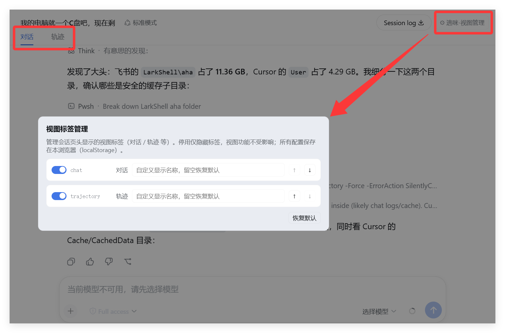

# dsh-view-manager

Manage the **view tabs** in the DeepSeek Harness Web GUI session header — the
tabs contributed through the `conversation.view` slot (e.g. **对话 / Chat**,
**轨迹 / Trajectory**, and any future view plugins).

| 简体中文 | [English](README.en.md) |
| --- | --- |

## 功能 Features

- **启用/停用**：停用某个视图标签后，标签在会话页头隐藏（视图功能本身不受影响）
- **排序**：上移/下移调整标签显示顺序
- **重命名**：自定义标签显示名（留空恢复默认）
- **跟随语言**：插件文案随 DSH 界面语言自动切换（zh / en）
- **本地存储**：配置保存在浏览器 localStorage，即时生效，无需重启
- **更新提醒**：自动检测 npm 上的新版本，按钮红点 + 面板更新卡片提醒；支持「立即更新 / 忽略本版本 / 稍后」

## 效果预览 Preview



## 安装 Install

**方式一：从 npm 安装（推荐）**：

```sh
dsh plugin --profile web add dsh-view-manager
```

**方式二：从 GitHub 安装**：

```sh
dsh plugin --profile web add github:runcat-tommy/dsh-view-manager
```

**方式三：本地开发安装**——克隆本项目后，进入项目文件夹执行：

```sh
cd dsh-view-manager
dsh plugin --profile web add .
```

安装后**重启 Web UI**，打开任意会话，在会话页头右侧会出现
**⚙ 逃咪-视图管理** 按钮，点击即可打开管理面板。

## 使用 Usage

1. 打开一个会话（对话或轨迹界面）
2. 会话页头最右侧点击 **⚙ 逃咪-视图管理**
3. 面板中每个视图一行：
   - 开关：启用/停用（停用 = 隐藏标签）
   - `原名`：当前默认名称（跟随语言）
   - 输入框：自定义显示名（留空恢复默认）
   - ↑ / ↓：调整顺序
   - **恢复默认**：清空所有自定义配置

### 更新提醒

- 发现新版本时，按钮出现红点角标，hover 可看到版本号
- 打开面板顶部显示更新卡片：
  - **立即更新** → 确认命令 → 自动执行更新 → 验证版本 → 提示重启 Web UI
  - **忽略本版本** → 该版本不再提醒（可在卡片内「恢复提醒」）
  - **稍后** → 收起卡片
- 本地开发模式（link/file 源）更新按钮自动禁用

## 工作原理 How it works

- 数据源与官方一致：`slots.entries("conversation.view")`
  （`viewTabs()` 同源），所以永远能看到当前所有视图注册项
- 官方宿主渲染标签时没有隐藏/排序/重命名的扩展点，因此本插件在
  DOM 层应用配置：`[role="tablist"]` 内按钮按 entries 顺序对齐，
  隐藏用 `display:none`、排序用 flex `order`、重命名改 `textContent`，
  MutationObserver 守护，React 重渲染后自动重新应用
- 管理入口挂载在 `conversation.session.header.utilities`（list/session）
- 文案通过 `locale` 服务注册（`viewManager` 命名空间），跟随 DSH 语言
- 更新检测：node 半端提供 `/view-manager-api/version | check-update | update`
  三个路由（loopback 信任检查），对比 npm registry 与本地版本；更新后
  重新读取本地版本验证，不裸信退出码

## 开发 Development

```
dsh-view-manager/
├── package.json          # dsh.bundle.patch + dsh.client 声明
├── cordis.patch.yml      # profile 层 bundle patch
├── lib/
│   ├── index.js          # node 半端：更新检测/执行 API 路由
│   └── client.js         # 浏览器端：管理面板 + DOM 应用 + 更新卡片
```

本地调试（热更新需要 dev:web 编译，否则改后重启 Web UI）：

```sh
dsh plugin --profile web add file:./dsh-view-manager
```

## License

MIT
